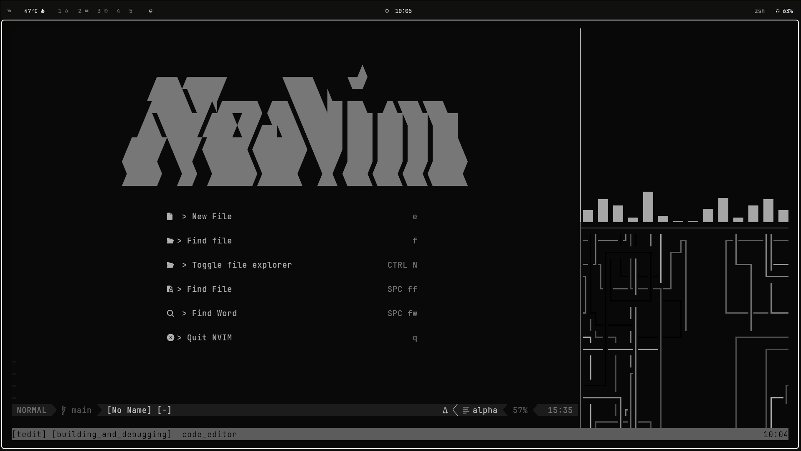
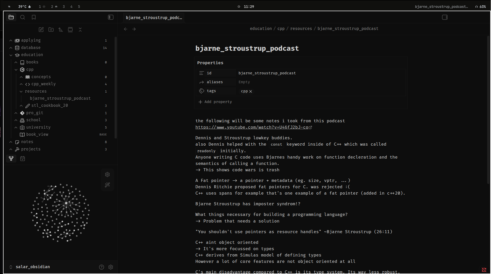

# Dotfiles

Personal Linux desktop configuration, kept close to the files that actually run the setup. The theme is intentionally quiet: dark surfaces, monochrome accents, compact spacing, and tools that stay out of the way.

## Showcase

| Neovim workspace | Notes workflow |
| --- | --- |
|  |  |

## What's here

- `hypr/` - Hyprland session, keybinds, monitor layout, startup apps, wallpaper handling.
- `waybar/` - top bar configuration, grouped modules, workspace state, audio, battery, tray, media, and power controls.
- `kitty/` - terminal font, padding, tab behavior, and monochrome color palette.
- `nvim/` - Neovim configuration with LSP, completion, Telescope, Treesitter, DAP, Obsidian support, markdown rendering, notes helpers, and a custom dashboard.
- `rofi/` and `wofi/` - application launchers styled to match the desktop.
- `mako/` - minimal notifications with urgency-specific styling.
- `cava/` - audio visualizer config, themes, and shader experiments.
- `fastfetch/` - compact system summary.
- `starship.toml` - small prompt with version-control noise turned down.
- `gtk-3.0/` and `fontconfig/` - desktop-wide theme and font preferences.

## Desktop Notes

The window manager is Hyprland with a simple two-monitor layout, small gaps, thin borders, and fast but restrained animations. The main binds use `SUPER` with vim-style focus and movement:

- `SUPER + Return` opens kitty.
- `SUPER + D` opens the launcher.
- `SUPER + H/J/K/L` moves focus.
- `SUPER + Shift + H/J/K/L` moves windows.
- `SUPER + F` toggles floating.
- `SUPER + R` reloads Hyprland.
- `SUPER + Shift + R` refreshes the wallpaper.

Waybar is split into small module files so the bar can change without turning one JSON file into a junk drawer. The current bar keeps workspaces and system state visible while leaving most of the screen to the active app.

## Neovim

The Neovim setup is built around daily editing rather than plugin collecting. It includes language tooling, fuzzy finding, completion, diagnostics, debugging, note-taking, markdown rendering, and a custom start screen. The screenshots show the monochrome dashboard and the notes-oriented workflow that pairs with Obsidian.

Notable plugin areas:

- LSP and Mason setup under `nvim/lua/salar/plugins/lsp/`.
- Completion and snippets through `nvim-cmp` and LuaSnip.
- Navigation through Telescope, nvim-tree, Trouble, and Treesitter.
- Writing support through Obsidian and render-markdown.
- UI polish through lualine, alpha, dressing, satellite, and related small helpers.

## Setup

This repository is meant to live at `~/.config`. It is not a universal installer, and a few values are machine-specific, especially monitor names, keyboard layout, and local scripts referenced by Hyprland.

Core packages used by this setup include:

- Hyprland
- Waybar
- kitty
- rofi or wofi
- mako
- Neovim
- fastfetch
- Starship
- CAVA
- JetBrainsMono Nerd Font or another Nerd Font

After placing the files, review:

- `hypr/hyprland.conf` for monitor names, keyboard layout, startup commands, and keybinds.
- `hypr/set-wallpaper.sh` for wallpaper behavior.
- `waybar/config.json` and the `waybar/Modules*` files for bar modules.
- `kitty/kitty.conf` for font family and size.
- `nvim/init.lua` and `nvim/lua/salar/` for editor behavior.

## Repository Hygiene

The `.gitignore` keeps local application state, caches, logs, browser data, and machine-specific files out of version control. Config files that define the desktop are kept in plain text where possible, so changes can be reviewed without extra tooling.
